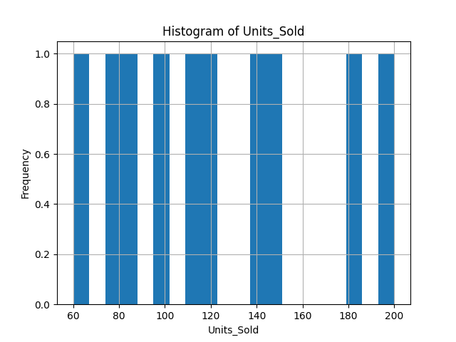
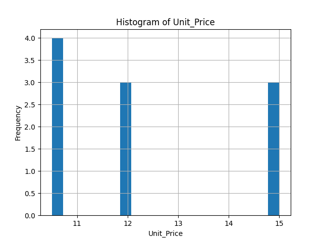
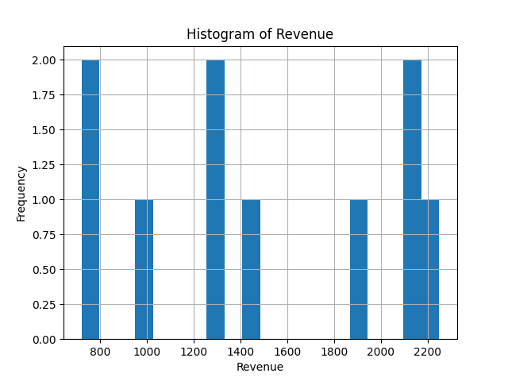

```markdown
# Data Analysis Report

## 1. Overview

This report presents an analysis of the provided dataset, including key descriptive statistics and visualizations. The primary goal is to understand the distribution and characteristics of the numerical features in the dataset.

## 2. Data Analysis

### 2.1 General Statistics

*   **Dataset Shape:** The dataset contains 10 records.
*   **Missing Values:** No missing values were found across any of the columns, ensuring data completeness for the analysis.

    ```
    Date          0
    Region        0
    Product       0
    Units_Sold    0
    Unit_Price    0
    Revenue       0
    dtype: int64
    ```

### 2.2 Descriptive Statistics for Numerical Columns

Below are the key descriptive statistics for the numerical columns: `Units_Sold`, `Unit_Price`, and `Revenue`.

#### Units_Sold
*   **Count:** 10
*   **Mean:** 121.5
*   **Median:** 115.0
*   **Standard Deviation:** 45.77
*   **Minimum:** 60
*   **Maximum:** 200

#### Unit_Price
*   **Count:** 10
*   **Mean:** 12.3
*   **Median:** 12.0
*   **Standard Deviation:** 1.97
*   **Minimum:** 10.5
*   **Maximum:** 15.0

#### Revenue
*   **Count:** 10
*   **Mean:** 1487.25
*   **Median:** 1372.5
*   **Standard Deviation:** 565.20
*   **Minimum:** 720.0
*   **Maximum:** 2250.0

## 3. Visualizations

The following histograms illustrate the distribution of `Units_Sold`, `Unit_Price`, and `Revenue`.

### Units Sold Distribution



### Unit Price Distribution



### Revenue Distribution


```